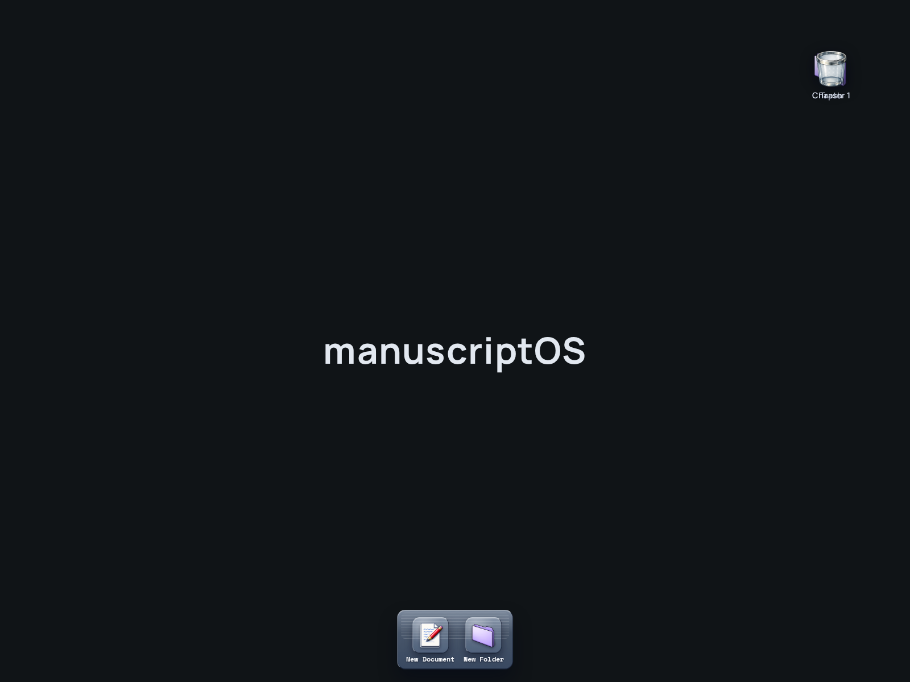
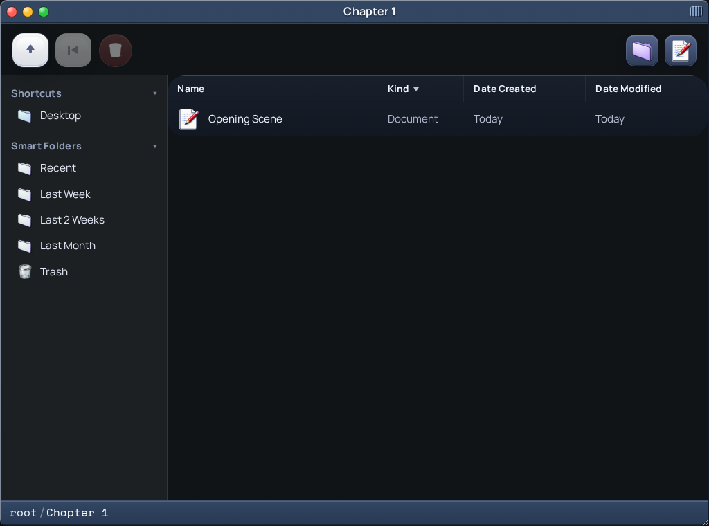
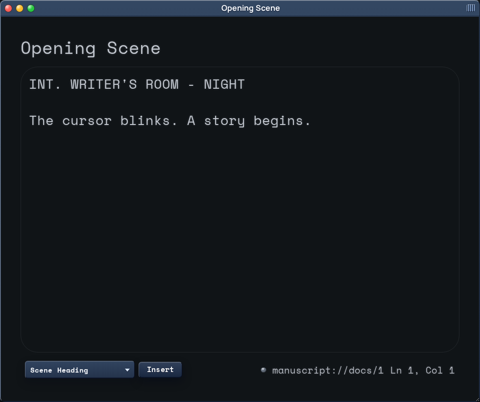

# Insanely Great Writer



Insanely Great Writer (also referred to in project notes as manuscriptOS) is a Ruby on Rails 8.1 writing app with a retro Mac OS 9-inspired desktop interface.

It is a Rails monolith that uses:

- Ruby 4.0.1
- Rails 8.1
- SQLite for the primary database, cache, queue, and cable
- Hotwire (`turbo-rails` + `stimulus-rails`)
- Import maps for JavaScript
- Dart Sass for styles
- Devise for authentication

No Node.js or external database is required for local development.

## Features

- Desktop-style writing environment
- Documents, folders, notes, and shortcuts
- Devise-based authentication
- SQLite-backed local setup with minimal moving parts

## Screenshots

### Folder window



### Document window



## Requirements

### Runtime

- Ruby `4.0.1`
- Bundler
- SQLite

### System packages

The repo notes currently call out these dependencies:

- `sqlite3`
- `libvips-dev`
- `libyaml-dev`
- `libssl-dev`
- `libreadline-dev`
- `zlib1g-dev`
- `libffi-dev`

## Getting started

```bash
bundle install
bin/rails db:prepare
bin/dev
```

Then open:

- `http://localhost:3000`

## Development commands

| Task | Command |
|---|---|
| Install gems | `bundle install` |
| Prepare database | `bin/rails db:prepare` |
| Start dev server + Sass watcher | `bin/dev` |
| Start Rails only | `bin/rails server -p 3000` |
| Build CSS once | `bin/rails dartsass:build` |
| Run tests | `bin/rails test` |
| Run RuboCop | `bin/rubocop` |
| Run Brakeman | `bin/brakeman` |
| Run bundler-audit | `bin/bundler-audit` |
| CI convenience script | `bin/ci` |

## Environment variables

Local secrets should live in:

- `.env.development`

This app uses `dotenv-rails`, so `.env.development` is loaded automatically in local development.

Common local environment variables include:

```env
SMTP_ADDRESS=smtp.porkbun.com
SMTP_PORT=587
SMTP_USERNAME=hey@manuscriptos.com
SMTP_PASSWORD=your-real-password
SMTP_DOMAIN=manuscriptos.com
DEVISE_MAILER_SENDER=hey@manuscriptos.com
APP_HOST=localhost
APP_PORT=3000
```

## Authentication notes

Authentication is handled with Devise.

Repo notes mention that Devise is configured with `:confirmable`. If you create a user manually in the Rails console for local testing, call:

```ruby
user.skip_confirmation!
```

before saving.

## App routes and capabilities

The current app includes routes for:

- home / desktop UI
- authentication (`/login`, `/register`, `/logout`)
- documents
- folders
- notes
- shortcuts
- health checks at `/up`

## Testing and quality checks

Run the full test suite:

```bash
bin/rails test
```

Run linting:

```bash
bin/rubocop
```

Run security scanning:

```bash
bin/brakeman
bin/bundler-audit
```

Run the repo's CI helper locally:

```bash
bin/ci
```

## CSS and frontend notes

The app uses `dartsass-rails` for styles.

- `bin/dev` starts both Rails and the Sass watcher via `Procfile.dev`
- If you run Rails manually, build CSS first with `bin/rails dartsass:build`
- JavaScript is managed with `importmap-rails`, so no Node.js or npm setup is required

## Database

The project uses SQLite in all environments.

Local database files live in `storage/`:

- `storage/development.sqlite3`
- `storage/test.sqlite3`

Production also uses SQLite, including separate files for cache, queue, and cable.

## Deployment

Project notes indicate the app is currently deployed on Fly.io.

Current Fly app:

- `insanely-great-writer-holy-fog-4587`

Current production URL:

- <https://insanely-great-writer-holy-fog-4587.fly.dev/>

Useful deploy commands:

```bash
flyctl deploy -a insanely-great-writer-holy-fog-4587
flyctl status -a insanely-great-writer-holy-fog-4587
flyctl logs -a insanely-great-writer-holy-fog-4587
flyctl open -a insanely-great-writer-holy-fog-4587
```

Because production uses SQLite on a Fly volume, the current documented setup is a single-machine deployment.

## Important files

- `AGENTS.md` — repo-specific developer notes and commands
- `BOOTSTRAP.md` — practical setup and deployment guide
- `DEPLOY_FIXES.md` — Fly deployment issues and fixes already applied
- `docs/launch_checklist.md` — launch readiness checklist with safety and anti-hacking review steps

## Health check

Rails exposes a health endpoint at:

- `/up`

## License

No license file is currently present in the repository. Add one if public distribution terms are needed.
